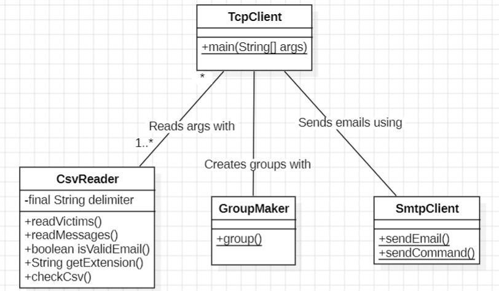
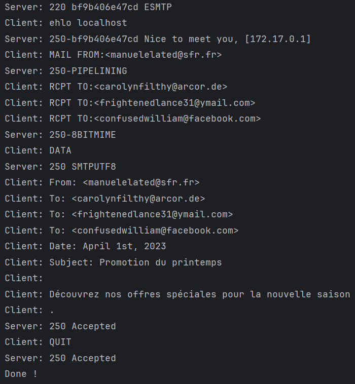

# DAI - Lab 4 - TCP client application to send prank e-mails using SMTP #

## 1. Description of our project ##
In this project, we created a **TCP client** application in Java. 
This client application uses the Socket API to communicate with an **SMTP** server. \
When you run it, it is able to receive paths of csv files of victims and messages and a number n of groups to create
as arguments, and then to group the victims into n groups and finally send to each group an email containing one of 
the messages using SMTP.

## 2. Instructions for setting up your mock SMTP server ##
If you want to test our TCP client on a mock server, you can use **maildev**:
https://github.com/maildev/maildev/tree/master \
To set up a maildev mock email server, pull maildev's docker image: https://hub.docker.com/r/maildev/maildev
and run it on your device. \
*Example commands to do so:* \
docker pull maildev/maildev \
docker run -p 1080:1080 -p 1025:1025 maildev/maildev \
You can then access maildev's user interface by visiting http://localhost:1080/ on a web browser.
 
## 3. Configuring the tool and running a prank campaign ##
To use our application, start by cloning this repository, e.g. using \
git clone https://github.com/Maxime-sch/dai-lab-smtp \
If you want to send emails to real SMTP servers, edit the SERVER_ADDRESS and DOMAIN variables in SmtpClient.java. 
Then, compile and run our project, e.g. using: \
javac [filePath of TcpClient.java on your machine]  \
java TcpClient [your victims file path] [your messages file path] [your number of groups] \
This will send the e-mails and the SMTP requests from the application and answers from the server
should be displayed in your terminal. \
If you are using maildev, the emails should be displayed in the browser page mentioned in section 2.

## 4. Description of our implementation ##

### Class diagram ###

### TcpClient (main) ###
The main method gets 2 csv files and 1 int as parameters, which are:\
-Victims list\
-Messages list\
-Number of groups\
The program then form n groups by selecting 2-5 e-mail addresses from the file for each group.\
The first address of the group is the sender, the others are the receivers (victims).\
For each group, the program selects one of the e-mail messages.\
The respective messages are then sent to the different groups using the SMTP protocol.\

### CSVReader ###
This class is not static as its methods depend on the separator we would like to use to handle csv files.
#### VictimsReader ####
Provides a method to parse a csv file and return a List of email addresses and to handle invalid inputs.
#### MessagesListReader ####
Provides a method to parse a csv file and return a List of subjects and a List of bodies for the prank e-mails to
send as well as handle invalid inputs.

### GroupMaker ###
Provides a method to group an array of e-mail addresses into n groups of 2-5 people, and to handle situations where
n is too big or too small.

### SmtpClient ###
Provides a method to send a message which appears to be sent by a specific email address, to defined email addresses
using SMTP.

### Example dialog between client and server ###
This was displayed in the terminal after sending an email using our application.

